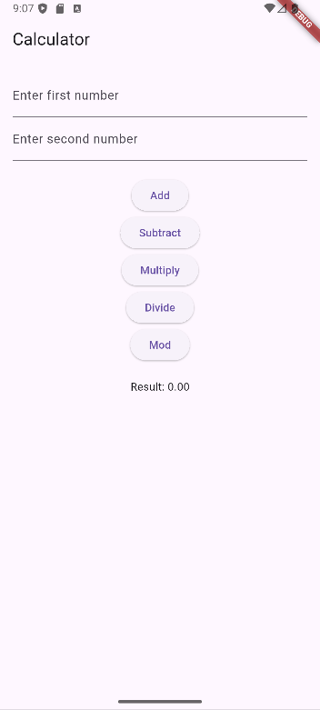

# Experiment 3: GUI Application – Calculator

## Student Information
* **Name:** Ayush  
* **Roll Number:** 23EACAD025  
* **Batch:** Alpha-1  
* **Section:** G-1  
* **Department:** Artificial Intelligence & Data Science  
* **Course:** B.Tech – AI & Data Science  

---

## Aim
To design and implement a **GUI-based calculator** using Flutter widgets that performs basic arithmetic operations.

---

## Procedure
1. Created input fields using `TextField` widgets.  
2. Used `TextEditingController` to capture user input.  
3. Implemented buttons for **addition, subtraction, multiplication, and division**.  
4. Managed state dynamically using `setState()` to update results.  
5. Displayed results in real-time on the screen.  

---

## Output
The application successfully performs arithmetic operations (+, −, ×, ÷) on two numbers entered by the user and displays the result dynamically.



---

## Conclusion
This experiment demonstrated how to build a **Flutter-based calculator** with multiple operations, integrating widgets, state management, and user input handling.

---

## How to Run

1. Ensure you have **Flutter SDK** installed and added to PATH.  
2. Clone this repository and navigate to the experiment folder:
   ```bash
   git clone https://github.com/<classroom-org>/<repo-name>.git
   cd <repo-name>/Experiment_X
